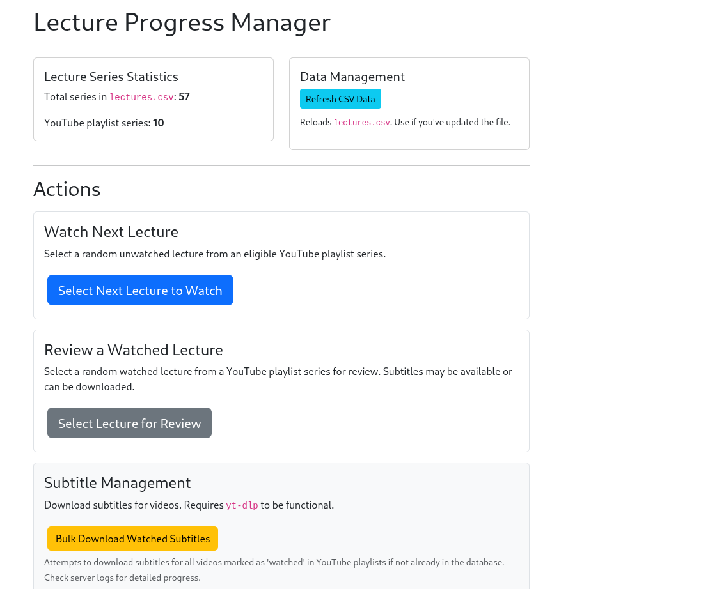
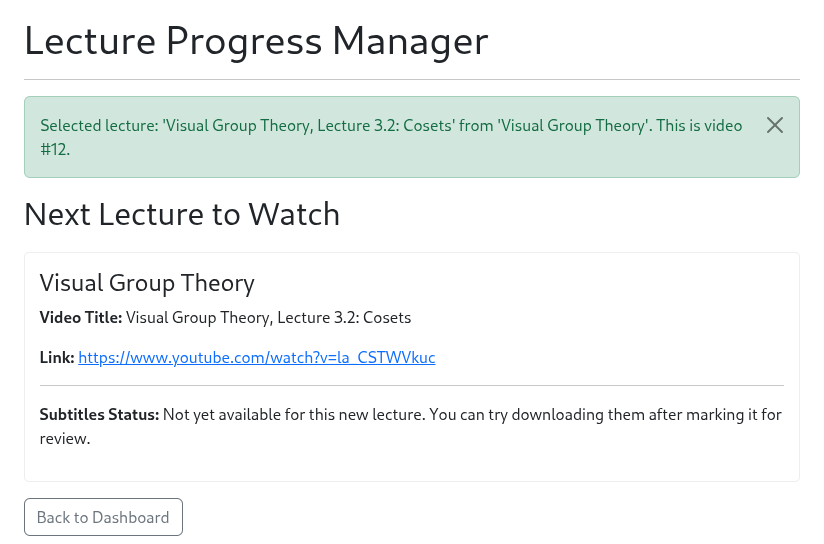
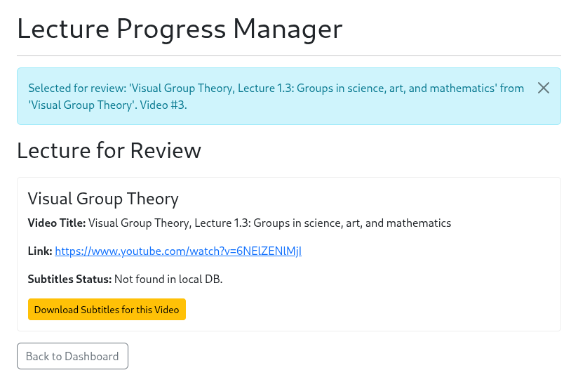
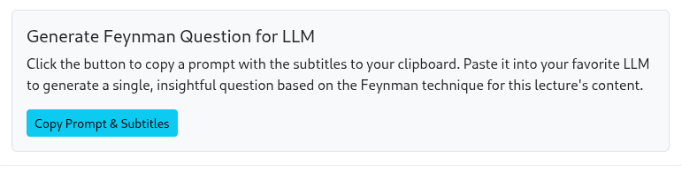

# Youtube Lecture Playlist Progress Manager & Feynman Question Generator

I built this small tool to better manage my YouTube lecture progress and improve my active learning. It lets me quickly generate Feynman-style prompts from subtitles to get deep review questions from an LLM.


<p align="center">
  
</p>

This Flask app helps you:
- Track watched videos via a simple `lectures.csv`.
- Get random "Next Lecture" or "Review Lecture" suggestions.
- Download and clean YouTube video subtitles.
- Instantly copy a tailored prompt + subtitles to an LLM for insightful Feynman-based questions.

**(Shout-out to Professor Macauley for his amazing lecture series on Visual Group Theory, highly recommended!)**

## Key Features ✨

*   **Smart Lecture Selection:** Picks next/review videos from YouTube playlists.
*   **Subtitle Powerhouse:** Downloads, cleans (VTT to text), and stores subtitles locally (SQLite).
*   **Feynman LLM Prompts:** One-click copy of a prompt + subtitles to generate deep-learning questions.
*   **CSV Driven:** Manage your courses easily with `lectures.csv`.
*   **Automatic CSV Sync:** Optional: Keep `lectures.csv` updated from a remote URL.

## Why Feynman?

The Feynman Technique helps you learn by teaching. Instead of just watching passively, this tool prompts you to *explain what you learned*—forcing clarity and exposing gaps. After each lecture, generate a question that tests whether you truly understand the material, not just remember it.

## Quick Demo 🚀

1.  **Select New Lecture to Watch:**
    <p align="center"></p>
2.  **Select Lecture for Review & Get Subtitles:**
    <p align="center"></p>
3.  **Generate Feynman Question Prompt for LLM:**
    <p align="center"></p>
    The prompt guides your LLM to create a single, insightful question based on the subtitles.

## Getting Started 🏁

**1. Prerequisites:**

    - Python 3.7+
    - `yt-dlp` (for YouTube features) - [Install Guide](https://github.com/yt-dlp/yt-dlp#installation)
    - A browser (like Firefox) for `yt-dlp` cookie access.


**2. Setup:**
   ```bash
   # Clone the repository
   git clone https://github.com/Dauriel/youtube-lecture-manager
   cd youtube-lecture-manager

   # Create and activate a virtual environment (recommended)
   python -m venv venv
   source venv/bin/activate  # Windows: venv\Scripts\activate

   # Install dependencies
   pip install -r requirements.txt
   ```

**3. Configuration:**
   - **`lectures.csv`:** Create this in the root directory to list your lecture series. See format below or the example in the repo.
     *(Optional)* Configure `URL` in `load_df.py` to auto-download this CSV.
   - **`yt-dlp` Cookie Access:**
     The app uses `"--cookies-from-browser","firefox"` by default. Ensure you're logged into YouTube on Firefox.
     *For alternatives (e.g., `cookies.txt` or different browser/profile), see detailed setup.*

**4. Run:**
   ```bash
   python app.py
   ```
   Then open `http://127.0.0.1:5000/` in your browser.

<details>
<summary><strong>📄 Click for Detailed Setup & Configuration</strong></summary>

---

### `lectures.csv` Format

Your `lectures.csv` should have at least these columns:
-   `Lecture Series`: Name of the series.
-   `Current`: Number of videos watched.
-   `Total`: Total videos in the series.
-   `Playlist URL`: Full YouTube playlist URL.

Example:
```csv
Lecture Series,Current,Total,Playlist URL
Advanced Quantum Physics,0,35,https://www.youtube.com/playlist?list=PLxxxxxxxxx
```

### `load_df.py` Configuration (Automatic CSV Download)

If you want `lectures.csv` to be downloaded from a URL (e.g., a published Google Sheet):
1.  Open `load_df.py`.
2.  Set the `URL` variable: `URL = "YOUR_DIRECT_CSV_DOWNLOAD_LINK_HERE"`

### `yt-dlp` Cookie Access Details

`yt-dlp` needs YouTube cookies for full access (e.g., private/age-restricted content).
The default is `"--cookies-from-browser","firefox"` in `lecture_manager_core.py`.

-   **Firefox Profile:** If not using the default/most recent Firefox profile, you might need to specify the path: `"--cookies-from-browser", "firefox:/path/to/your/firefox/profile"`.
-   **Using `cookies.txt` (Alternative):**
    1.  Use a browser extension (e.g., "Get cookies.txt LOCALLY") to export YouTube cookies as `cookies.txt` to the project root.
    2.  In `lecture_manager_core.py`, change `"--cookies-from-browser","firefox",` to `"--cookies", "cookies.txt",` in `get_playlist_videos_yt_dlp` and `download_subtitles_yt_dlp`.

### Database
The `lecture_subtitles.db` (SQLite) is created automatically.

---
</details>

<details>
<summary><strong>🛠️ Click for Usage Details & Troubleshooting</strong></summary>

---

### How to Use

-   **Dashboard:** Main navigation.
-   **Refresh CSV Data:** Reloads/re-downloads `lectures.csv`.
-   **Select Next Lecture to Watch:** Get a new unwatched video suggestion.
-   **Select Lecture for Review:** Get a random watched video. Download subtitles if needed.
-   **Copy Prompt & Subtitles:** If subtitles are shown, click to copy the Feynman prompt + text for your LLM.
-   **Bulk Download Watched Subtitles:** Downloads subtitles for all 'watched' videos.

### Customizing the LLM Prompt
The default Feynman prompt is in `templates/lecture_display.html` (in the `<textarea>`). Modify it to change LLM instructions.

### Troubleshooting Common Issues

-   **`yt-dlp` not found/working:**
    -   Ensure `yt-dlp` is installed and in your system's PATH.
    -   Verify `YT_DLP_PATH` in `lecture_manager_core.py`.
-   **Subtitle download failures:**
    -   Check `yt-dlp` cookie setup (Firefox login, profile, or `cookies.txt`).
    -   The video might not have English subtitles.
    -   Update `yt-dlp`: `yt-dlp -U`.
    -   Check Flask console logs for `yt-dlp` errors.
-   **CSV errors:**
    -   Ensure `lectures.csv` exists (or `load_df.py` is set up) and has correct format/columns.

---
</details>

## Contributing 🤝

Contributions, issues, and feature requests are welcome! Feel free to fork and submit a PR.
Possible enhancements: AJAX for smoother UI, direct CSV editing, more platform support.

## License 📜

This project is licensed under the MIT License - see the `LICENSE` file for details.
